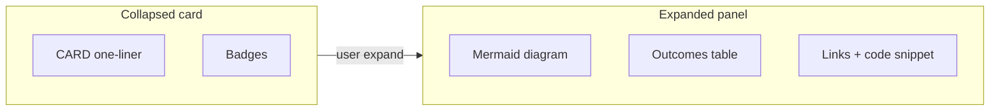

# Projects — content reference

> **Purpose:** Source-of-truth copy and UX artefacts for the portfolio **Projects** section.  
> **Do not** treat this as rendered HTML — map `[CARD]` / `[EXPAND]` blocks to expandable cards, embedded Mermaid, and GitHub-style badges in the site implementation.

---

## Section intro (narrative frame)

**Headline (suggested):** Systems that ship — and explain themselves.

**Body (short):**  
These are not slide-deck case studies. Each project is a working artefact: open-source tools, published packages, and agentic automation aimed at real engineering pain (API contract drift, documentation fidelity, chaotic UI state). The section should feel like browsing a maintainer’s GitHub — dense signal up front, depth on demand.

**UX intent**

| Principle | Implementation hint |
|-----------|---------------------|
| README energy | Badges, pipeline diagrams, “outputs” callouts (`changes_count`, npm version) |
| Expand, don’t scroll | One screen of cards; Mermaid + tables live inside expanded panels |
| Proof over prose | Link to repo, live docs, and workflow YAML snippets where relevant |
| Flagship first | **Fark.ai** leads — highest novelty and cross-stack story |

---

## Content contract (for implementers)

| Marker | Use |
|--------|-----|
| `[CARD]` | Collapsed card: title, one-liner, 2–3 badges, primary CTA |
| `[EXPAND]` | Accordion / drawer body: narrative, diagrams, tables, code samples |
| `<!-- artefact: … -->` | Non-copy hints for graphs, demos, or embeds |

Per-project detail files:

- [`content/projects/fark-ai.md`](projects/fark-ai.md)
- [`content/projects/parcel-add-source.md`](projects/parcel-add-source.md)
- [`content/projects/react-synced-state.md`](projects/react-synced-state.md)

---

## Display order (recommended)

| # | Project | Rationale |
|---|---------|-----------|
| 1 | **Fark.ai** | Flagship: agentic CI, multi-repo, token-aware design |
| 2 | **React Synced State** | Published npm + rich docs site; shows DX craft |
| 3 | **Parcel Add Source** | Focused infra plugin; ties to docs site above |

---

## Project index (at-a-glance)

### 1. Fark.ai

`[CARD]` **Agentic GitHub Action that catches breaking API changes in backend PRs and proves impact across real frontend codebases.**

| Field | Value |
|-------|-------|
| Links | [GitHub](https://github.com/yashmahalwal/fark.ai) |
| Audience | Platform / API teams, monorepo owners, staff engineers shipping GraphQL/REST/gRPC |
| Tech | TypeScript, GitHub Actions, OpenAI agents, GitHub MCP, esbuild, Zod, `p-limit` |
| Outcomes (documented) | Action outputs: `changes_count`, `impacts_count`, `comments_count`; parallel frontend scans (default concurrency **5**); per-agent token budgets with wrap-up at **85%** / hard stop at **100%** |
| Detail | [fark-ai.md](projects/fark-ai.md) |

---

### 2. React Synced State

`[CARD]` **React hook that queues truthy UI state (modals, drawers, alerts) so only one “layer” wins — works on web and React Native.**

| Field | Value |
|-------|-------|
| Links | [Docs](https://yashmahalwal.github.io/react-synced-state/) · [GitHub](https://github.com/yashmahalwal/react-synced-state) · [npm](https://www.npmjs.com/package/@yashmahalwal/react-synced-state) |
| Audience | Frontend engineers fighting overlapping overlays / notification storms |
| Tech | TypeScript, React 16–18 peers, Jest, Parcel docs, MUI examples |
| Outcomes | **v1.0.5** on npm; docs built with live code samples (uses Parcel Add Source) |
| Detail | [react-synced-state.md](projects/react-synced-state.md) |

---

### 3. Parcel transformer — Add Source

`[CARD]` **Parcel 2 transformer that injects encoded source into bundled assets — power live “view source” in component docs.**

| Field | Value |
|-------|-------|
| Links | [GitHub](https://github.com/yashmahalwal/parcel-transformer-add-source) · [npm](https://www.npmjs.com/package/@yashmahalwal/parcel-transformer-add-source) |
| Audience | Design-system / docs-site maintainers on Parcel |
| Tech | TypeScript, `@parcel/plugin`, Bats CLI tests, yalc fixture pipeline |
| Outcomes | **v1.0.0**; scoped to `CodeSamples/**` paths to limit dev-build overhead |
| Detail | [parcel-add-source.md](projects/parcel-add-source.md) |

---

## Cross-project UX patterns (cohesion)

Reuse across all project cards:

1. **Hero strip:** `[CARD]` one-liner + badge row (`GitHub` · `npm` · `docs` · `license`).
2. **Expand panel tabs:** Overview · Architecture (Mermaid) · Outcomes · Stack · Links.
3. **Artefact rail:** pinned diagram(s) with light/dark theme; optional “open in GitHub” for full README.
4. **Comparison table (optional footer):** three rows — problem domain, integration surface (CI / bundler / runtime), proof link.

---

## Suggested global artefacts (Projects section)

| Artefact | Description |
|----------|-------------|
| **Impact funnel** | Animated: PR opened → backend batches → N frontends → inline comments |
| **Stack radar** | Small chart: CI / bundler / runtime axes for the three projects |
| **Timeline** | Publication order: Parcel plugin → Synced State docs → Fark.ai (approximate; verify dates in git history when styling) |
| **Badge strip** | shields.io-style: TypeScript, MIT, GitHub Actions, Parcel 2.x, npm |

---

## Research notes & gaps

| Source | Status |
|--------|--------|
| [fark.ai README + docs](https://github.com/yashmahalwal/fark.ai) | ✅ Full pipeline, agents, token strategy |
| [parcel-transformer-add-source](https://github.com/yashmahalwal/parcel-transformer-add-source) | ✅ `readme.md` (lowercase filename on `main`) |
| [react-synced-state](https://github.com/yashmahalwal/react-synced-state) | ✅ README, hooks source, docs site problem page |
| Production usage metrics | ❌ Not claimed — no star/download counts invented |
| Private demo frontends for Fark | ⚠️ Workflow examples use placeholder `your-org/your-frontend` repos |

---

## Parent-agent summaries (post-research)

**Fark.ai:** Multi-agent GitHub Action on backend PRs: analyzes diffs for breaking API surface, scans checked-out frontends in parallel (capped concurrency), posts anchored inline review comments — with explicit token/step budgets per agent.

**Parcel Add Source:** Parcel 2 transformer + config hook embeds base64 (or custom-encoded) source into selected assets for documentation sites, with Bats-tested fixtures.

**React Synced State:** `useSyncedState` / `useSyncedValue` global queue ensures only one truthy “overlay” state wins per layer/priority — documented with interactive examples; npm package used in production docs pipeline.
