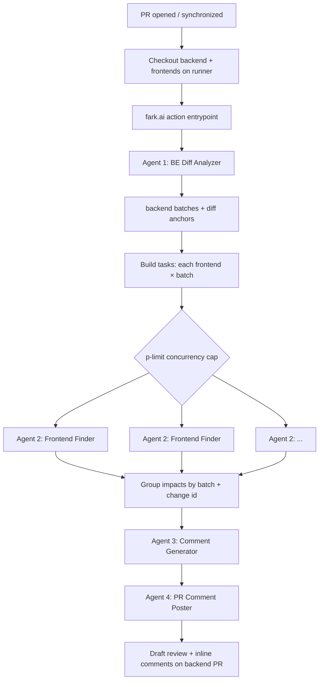
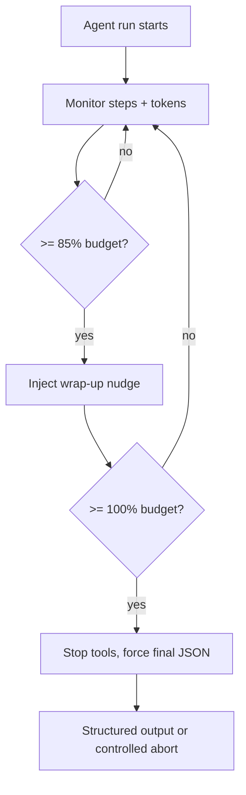

# Fark.ai — project detail

**Slug:** `fark-ai`  
**Flagship:** yes (display first)

---

## `[CARD]`

**One-liner:** Agentic GitHub Action — breaking backend API changes, validated against your real frontend repos, posted as inline PR comments.

**Badges (suggested):**

```text


```

**CTAs:** [Repository](https://github.com/yashmahalwal/fark.ai) · [Architecture doc](https://github.com/yashmahalwal/fark.ai/blob/main/docs/fark-ai/01-architecture.md)

---

## `[EXPAND]` — Summary

Backend teams ship API changes in isolation; frontends discover breakage after merge. **Fark.ai** runs on backend pull requests: an agent reads the PR diff and identifies **breaking API interface changes** (REST, GraphQL, gRPC). For each frontend codebase already checked out on the runner, parallel agents search for **confirmed** breakage patterns — not speculative string matches. A comment generator turns findings into **inline review comments** anchored to exact diff hunks; a poster agent creates a draft review and submits them.

Design emphasis: **token efficiency and speed** — diff-first reads, bounded `bash` search, batched backend changes, `p-limit` concurrency, and per-agent step/token ceilings with graceful wrap-up when budgets are exceeded.

---

## `[EXPAND]` — Key outcomes (documented only)

| Signal | Source | Notes |
|--------|--------|-------|
| `changes_count` | Action output | Breaking backend changes detected |
| `impacts_count` | Action output | Frontend impacts aggregated |
| `comments_count` | Action output | Inline comments posted |
| Default frontend concurrency | `frontend_finder_concurrency_limit` = **5** | Configurable input |
| Agent token defaults | README table | e.g. `be_analyzer` max **100k** total tokens; `frontend_finder` **150k** |

> No production adoption or $ savings metrics in public docs — do not display invented KPIs.

---

## `[EXPAND]` — Tech stack

| Layer | Technologies |
|-------|----------------|
| Runtime | Node.js, TypeScript, esbuild → `dist/index.js` |
| Orchestration | GitHub Actions (`action.yml`), custom action inputs |
| AI | OpenAI via `generateText`, multi-step agents with tools |
| Integrations | GitHub MCP (`pull_request_read`, review APIs), read-only overlay FS on checkouts |
| Validation | Zod schemas between pipeline steps |
| Concurrency | `p-limit` for `(frontend × backend batch)` tasks |
| DX | Husky pre-push rebuilds/commits `dist`, `.env.example` for local dev |

---

## `[EXPAND]` — Audience

- **Primary:** Staff/platform engineers owning API contracts across web + mobile repos  
- **Secondary:** Tech leads reducing “works on backend CI, breaks in app” incidents  
- **Not for:** Greenfield repos without checked-out consumer code on the runner

---

## `[EXPAND]` — Architecture

### Pipeline (runner + action)



### Agent responsibilities

```mermaid
flowchart LR
  subgraph A1 [BE Analyzer]
    D1[PR diff as source of truth]
    D2[Breaking API surface only]
    D3[Emit line anchors for inline comments]
  end
  subgraph A2 [Frontend Finder]
    F1[One frontend + one batch]
    F2[bash search, bounded output]
    F3[Confirm real breakage in source]
  end
  subgraph A3 [Comment Generator]
    C1[Markdown bodies per hunk]
    C2[Frontend Impact section when impacts exist]
  end
  subgraph A4 [PR Comment Poster]
    P1[Draft review lifecycle]
    P2[Fallback top-level section if inline fails]
  end
  A1 --> A2 --> A3 --> A4
```



### Token enforcement



---

## `[EXPAND]` — Integration sketch (for code artefact panel)

Consumers add a workflow on the **backend** repo, check out backend + each frontend to disk paths, then invoke `yashmahalwal/fark.ai@main` with a JSON `frontends` array matching checkout paths. The action does **not** clone repos itself.

<!-- artefact: collapsible YAML — "Quick start workflow" from README -->

---

## Suggested UI artefacts

| Artefact | Type | Content |
|----------|------|---------|
| **PR comment preview** | Mock UI | Sample inline comment with “Frontend Impact” grouping by `owner/repo:branch` |
| **Concurrency gauge** | Mini chart | Tasks queued vs `frontend_finder_concurrency_limit` |
| **Token budget bars** | Horizontal bars | Per-agent defaults from README (editable inputs in demo) |
| **Multi-frontend matrix** | Table | Rows = frontends, cols = backend batches → impact count cell |
| **Before / after** | Two-column | Traditional OpenAPI diff vs cross-repo consumer proof |

---

## Links

| Label | URL |
|-------|-----|
| Repository | https://github.com/yashmahalwal/fark.ai |
| Architecture | https://github.com/yashmahalwal/fark.ai/blob/main/docs/fark-ai/01-architecture.md |
| Speed & tokens | https://github.com/yashmahalwal/fark.ai/blob/main/docs/fark-ai/02-speed-and-tokens.md |
| Examples | https://github.com/yashmahalwal/fark.ai/blob/main/docs/fark-ai/05-examples.md |
