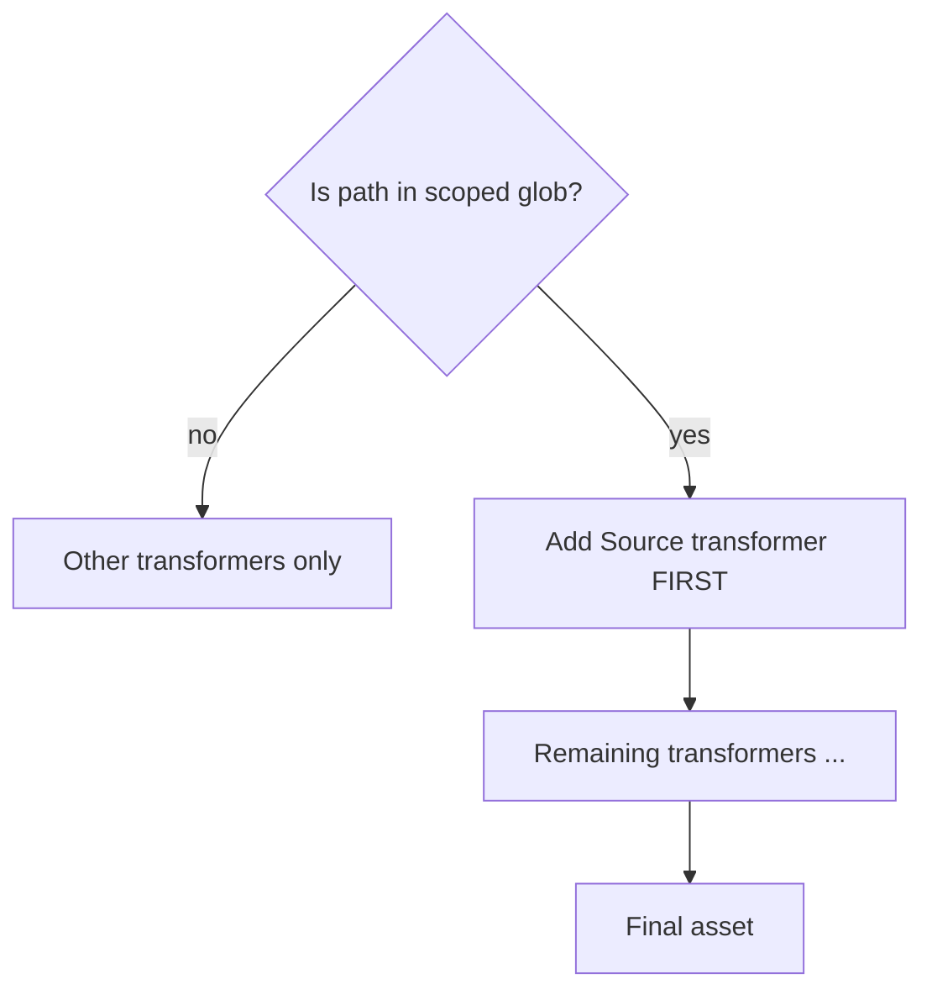

# Parcel transformer — Add Source — project detail

**Slug:** `parcel-add-source`  
**npm:** `@yashmahalwal/parcel-transformer-add-source` (install docs also reference `parcel-transformer-add-source-code`)

---

## `[CARD]`

**One-liner:** Parcel 2 transformer that embeds source (default base64) into bundled assets so documentation pages can show live, faithful code samples.

**Badges (suggested):**

```text


```

**CTAs:** [GitHub](https://github.com/yashmahalwal/parcel-transformer-add-source) · [Consumer docs example](https://yashmahalwal.github.io/react-synced-state/)

---

## `[EXPAND]` — Summary

Documentation sites often show components beside static snippets that drift from reality. This plugin runs early in Parcel’s transformer pipeline for **scoped globs** (e.g. `**/CodeSamples/**/*.{js,jsx,ts,tsx}`), reads the asset’s source, optionally encodes it, and rewrites the module via a user-defined `addSourceCode(source, encoded)` hook — commonly exporting `__sourceCode` for `atob` in the docs app.

**Performance guardrail:** only target folders that need embeddable source; running globally slows dev builds.

---

## `[EXPAND]` — Key outcomes

| Item | Detail |
|------|--------|
| Package version | **1.0.0** (per `package.json` on `main`) |
| Test strategy | Bats CLI against `test/project` fixture; yalc publish/link in `pretest` |
| Real-world consumer | React Synced State docs site lists this project as the documentation example |
| Config surface | `transformer-add-source.config.js` with required `addSourceCode`, optional `encode` |

---

## `[EXPAND]` — Tech stack

- **@parcel/plugin** transformer API (Parcel 2.x)
- TypeScript build → `build/`
- **Bats** + **yalc** for integration testing without Parcel test utils
- MIT licensed

---

## `[EXPAND]` — Audience

- Maintainers of **Parcel-based** design system / hook documentation sites  
- Teams wanting GitHub-README-style “source + demo” without a separate MDX pipeline  
- Not aimed at Vite/Webpack-only stacks without adaptation

---

## `[EXPAND]` — Build-time flow

```mermaid
flowchart LR
  A[Source file in CodeSamples/] --> B[Parcel asset graph]
  B --> C[@yashmahalwal/parcel-transformer-add-source]
  C --> D[Read source + encode]
  D --> E[addSourceCode hook in config]
  E --> F[Bundled module with __sourceCode export]
  F --> G[Docs app imports component + decodes source]
  G --> H[Render live preview + syntax block]
```

### Transformer ordering



> Plugin should be **first** in the transformer list so later transforms don’t obscure original source.

---

## `[EXPAND]` — Configuration pattern (artefact)

Typical `.parcelrc` fragment:

```json
{
  "extends": "@parcel/config-default",
  "transformers": {
    "**/CodeSamples/**/*.{ts,tsx}": [
      "@yashmahalwal/parcel-transformer-add-source",
      "..."
    ]
  }
}
```

Typical config export:

```js
module.exports = {
  addSourceCode(source, encodedSource) {
    return `${source}\nexport const __sourceCode="${encodedSource}"`;
  },
};
```

<!-- artefact: side-by-side — running component vs decoded source panel -->

---

## Suggested UI artefacts

| Artefact | Type | Notes |
|----------|------|-------|
| **Pipeline strip** | Horizontal steps | Source → Transform → Import in docs |
| **Glob scoper** | Interactive filter | Show perf warning when glob too broad |
| **Encoding toggle** | Demo control | base64 vs custom `encode()` |
| **TypeScript tunnel** | Code card | `declare module` pattern from readme |
| **Test harness badge** | Info chip | “Bats + yalc fixture” — signals maintainer rigor |

---

## Links

| Label | URL |
|-------|-----|
| Repository | https://github.com/yashmahalwal/parcel-transformer-add-source |
| npm | https://www.npmjs.com/package/@yashmahalwal/parcel-transformer-add-source |
| Example consumer docs | https://yashmahalwal.github.io/react-synced-state/ |
