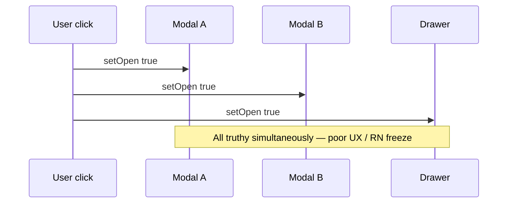
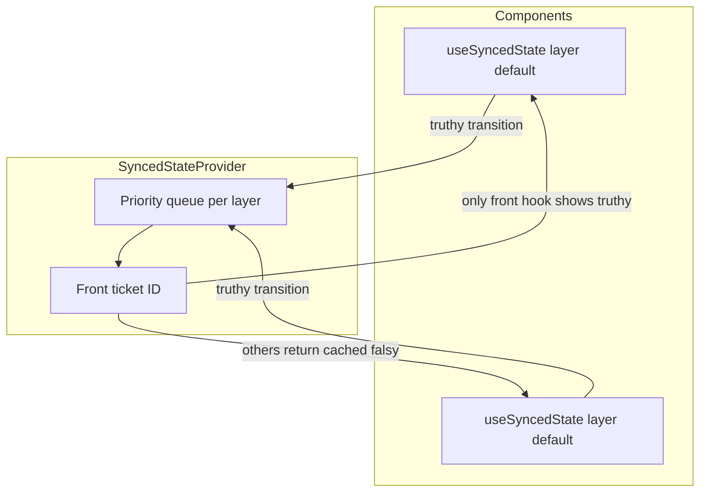
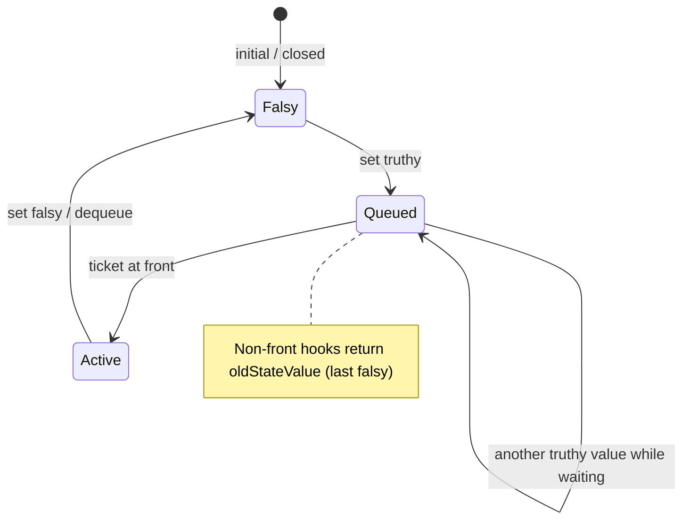

# React Synced State — project detail

**Slug:** `react-synced-state`  
**Package:** `@yashmahalwal/react-synced-state` **v1.0.5**

---

## `[CARD]`

**One-liner:** Queue and serialize truthy UI state across your React tree — one modal, drawer, or alert at a time, with layers and priorities.

**Badges (suggested):**

```text


```

**CTAs:** [Documentation](https://yashmahalwal.github.io/react-synced-state/) · [GitHub](https://github.com/yashmahalwal/react-synced-state) · [npm](https://www.npmjs.com/package/@yashmahalwal/react-synced-state)

---

## `[EXPAND]` — Summary

A single user action can flip multiple booleans (`open` on modal, drawer, snackbar) in the same tick. React batches updates but does **not** order competing overlays — on React Native, multiple modals can **freeze** the app.

**React Synced State** introduces a global queue (per **layer**) with optional **priority**. Hooks `useSyncedState` / `useSyncedValue` let a component’s *visible* state stay at the last falsy value until its queue ticket reaches the front — serializing “who gets to be truthy on screen.”

Docs site includes interactive “chaos” demo (uncontrolled modals) vs controlled synced version, plus concepts: queueing, layers, priority, and a notification-management example.

---

## `[EXPAND]` — Key outcomes

| Item | Detail |
|------|--------|
| npm | `@yashmahalwal/react-synced-state@1.0.5` |
| Peer deps | React `^16.8 \|\| ^17 \|\| ^18` |
| Tests | Jest (`use-synced-state`, priority queue) |
| Docs | Parcel-built site at `/react-synced-state` on GitHub Pages |
| Ecosystem tie-in | Docs use `@yashmahalwal/parcel-transformer-add-source` for live source in samples |

---

## `[EXPAND]` — Tech stack

| Area | Choice |
|------|--------|
| Library | TypeScript, `SyncedStateProvider` context, `PriorityStateQueue` |
| Public API | `useSyncedState`, `useSyncedValue`, `Config` (`layer`, `priority`, `shouldDequeue`) |
| Docs app | React 18, MUI, react-router, Parcel, Typedoc post-build |
| Quality | ESLint, Prettier, Husky, lint-staged |

---

## `[EXPAND]` — Audience

- Frontend engineers with **stacked overlays** (modals, drawers, toasts)  
- **React Native** teams hit by multi-modal freezes  
- Design-system authors documenting notification / layer policies

---

## `[EXPAND]` — Problem → mechanism

### Chaos without sync (concept)



### With global queue



### Truthy / falsy contract



---

## `[EXPAND]` — API surface (implementation hint)

`useSyncedState` returns **`[syncedState, setState, rawState]`**:

- **`syncedState`** — what UI should render (may lag until queue permits)  
- **`setState`** — standard React setter  
- **`rawState`** — immediate state for debugging/advanced cases

`useSyncedValue` wraps an existing state variable with the same queue semantics.

---

## Suggested UI artefacts

| Artefact | Type | Content |
|----------|------|---------|
| **“Click me” demo embed** | iframe / link-out | Docs “Problem” page uncontrolled modals |
| **Queue visualizer** | Animated list | Ticket IDs moving to front |
| **Layer swimlanes** | Diagram | Multiple independent queues |
| **Priority ladder** | Sorted list | Higher priority dequeues first within layer |
| **RN warning callout** | Alert chip | Freeze risk without sync |
| **Source + preview** | Split pane | Powered by Parcel Add Source pattern |

---

## Links

| Label | URL |
|-------|-----|
| Documentation | https://yashmahalwal.github.io/react-synced-state/ |
| Problem demo | https://yashmahalwal.github.io/react-synced-state/#/problem |
| Repository | https://github.com/yashmahalwal/react-synced-state |
| npm | https://www.npmjs.com/package/@yashmahalwal/react-synced-state |
