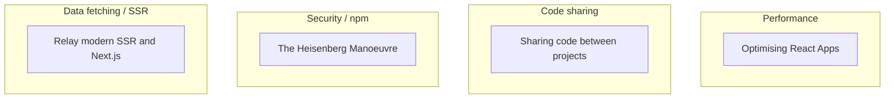
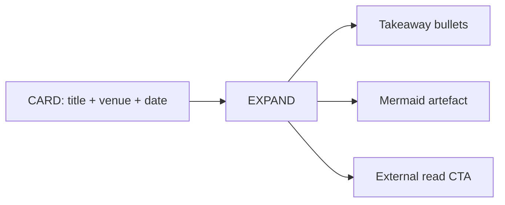
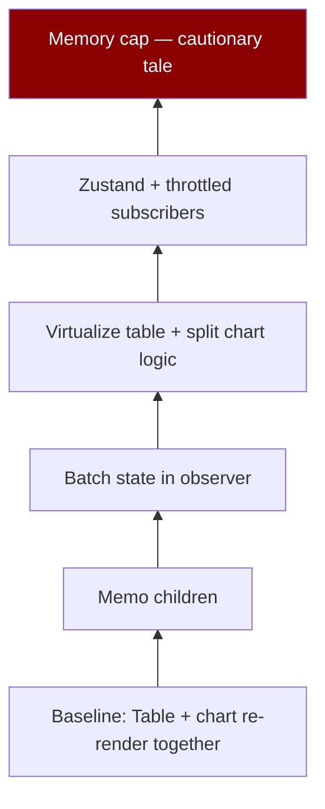
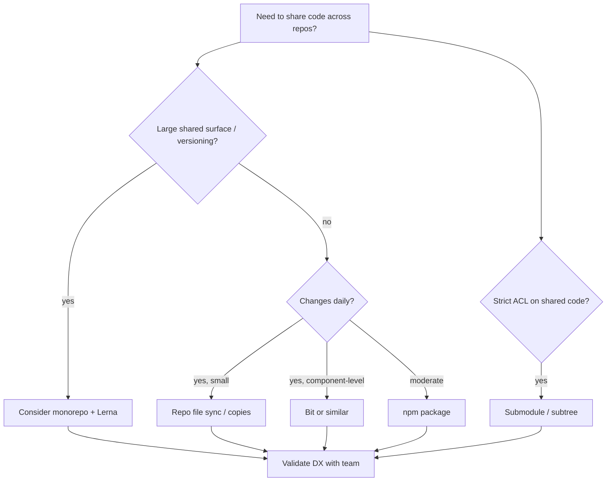
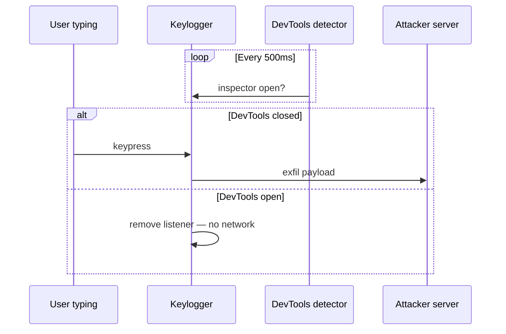
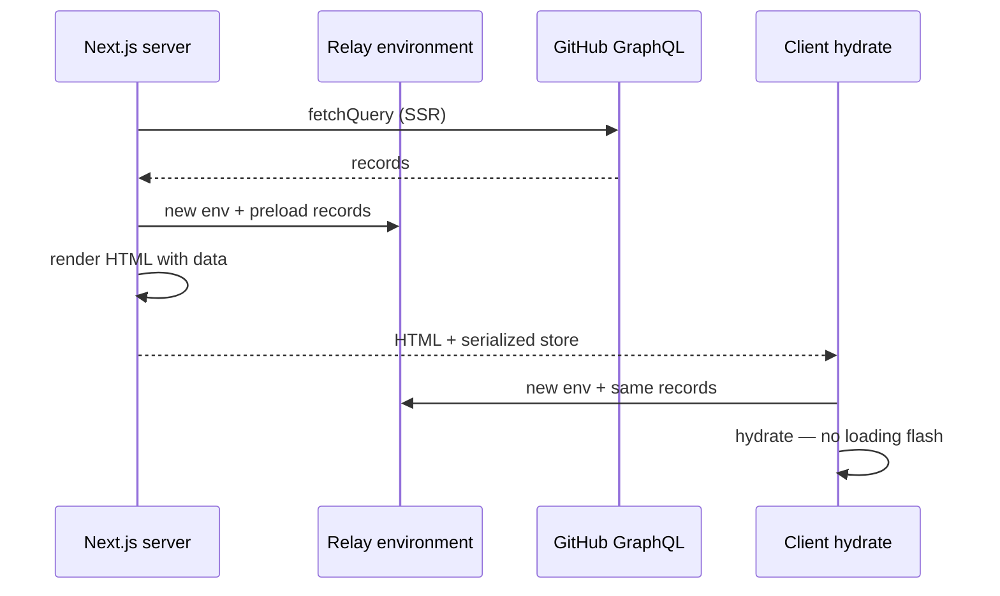

# Writing & publications — content reference

> **Purpose:** Source copy and UX artefacts for the portfolio **Writing** section.  
> Pair with Projects section patterns: `[CARD]` teasers, `[EXPAND]` depth, Mermaid as first-class artefacts.

---

## Section intro (narrative frame)

**Headline (suggested):** Long-form engineering — from React internals to supply-chain psychology.

**Body (short):**  
These articles are maintainer-grade explainers: profiling-driven optimization, cross-repo strategy comparisons, security demonstrations, and SSR integration guides. The section should read like a curated reading list with **thematic lanes**, not a chronological blog dump — each card surfaces *who it’s for* and *what decision it unlocks*.

**UX intent**

| Principle | Implementation hint |
|-----------|---------------------|
| Same card grammar as Projects | `[CARD]` + expand panel with takeaways + diagram |
| Thematic lanes | Filter chips: Performance · Code sharing · Security · Data/SSR |
| Venue honesty | Badge: DEV · Medium · date when known |
| No paywall pretense | External links open Medium/DEV; summaries are self-contained |

---

## Content contract

| Marker | Use |
|--------|-----|
| `[CARD]` | Title, venue, date, one-liner, 3 takeaway chips |
| `[EXPAND]` | Summary, decision artefacts, audience, link |
| `<!-- artefact: … -->` | Charts, decision trees, embed hints |

---

## Thematic grouping (display)

### Lane order (recommended)

1. **Performance** — flagship practical depth (DEV, 2024)  
2. **Data / SSR** — Relay + Next.js integration authority (Medium, 2020, updated 2021)  
3. **Code sharing** — architecture decision guide (Medium, 2021)  
4. **Security** — memorable npm threat model (Medium, 2020)

---

## Articles index

### Performance

#### Optimising React Apps

| Field | Value |
|-------|-------|
| **Venue** | [DEV Community](https://dev.to) |
| **Date** | 21 April 2024 |
| **Link** | https://dev.to/yashmahalwal/optimising-react-apps-56c6 |
| **Companion repo** | https://github.com/yashmahalwal/react-performance |
| **Live demo** | https://react-performance-omega.vercel.app/ |

`[CARD]` **Walk through profiling a real-time stock UI on React 18 — memoization, render batching, virtualization, Zustand, and when *not* to optimize.**

`[EXPAND]` — see [§ Optimising React Apps](#optimising-react-apps-detail) below.

---

### Code sharing

#### Sharing code between projects

| Field | Value |
|-------|-------|
| **Venue** | Medium |
| **Date** | 30 October 2021 |
| **Read time** | ~12 min |
| **Link** | https://yashmahalwal.medium.com/sharing-code-between-projects-1c35a8df456e |

`[CARD]` **Compare five ways to share logic across web and React Native — npm packages, Bit, monorepos, git submodules/subtrees, and automated file sync.**

`[EXPAND]` — see [§ Sharing code](#sharing-code-between-projects-detail) below.

---

### Security / npm supply chain

#### The Heisenberg Manoeuvre

| Field | Value |
|-------|-------|
| **Venue** | Medium |
| **Date** | 19 October 2020 |
| **Read time** | ~5 min |
| **Link** | https://yashmahalwal.medium.com/the-heisenberg-manoeuvre-c554744665d4 |
| **Demo apps** | https://morning-cove-53390.herokuapp.com/simple · https://morning-cove-53390.herokuapp.com/hacked |

`[CARD]` **Malware that pauses when DevTools is open — a hands-on npm keylogger thought experiment inspired by supply-chain attack writeups.**

`[EXPAND]` — see [§ Heisenberg Manoeuvre](#the-heisenberg-manoeuvre-detail) below.

---

### Data fetching / SSR

#### Relay modern: SSR and Next.js

| Field | Value |
|-------|-------|
| **Venue** | Medium |
| **Date** | 11 July 2020 (example updated May 2021) |
| **Read time** | ~15 min |
| **Link** | https://yashmahalwal.medium.com/relay-modern-ssr-and-next-js-e0a77ec3d7ea |
| **Example repo** | https://github.com/yashmahalwal/relay-ssr |

`[CARD]` **Make Relay deliver GraphQL data on the server for Next.js — per-request environments, preloaded records, and two integration paths (Next data APIs vs universal custom document).**

`[EXPAND]` — see [§ Relay SSR](#relay-modern-ssr-and-nextjs-detail) below.

---

## Cross-article UX patterns (mirror Projects)

1. **Lane filter** chips tied to mermaid grouping above.  
2. **Expand tabs:** Summary · Takeaways · Diagram · Audience · Read externally.  
3. **“Unlocks decision” footer** — one sentence: e.g. “Pick monorepo vs package.”  
4. **Related project link** where applicable (Parcel plugin ↔ Synced State docs; performance article ↔ general React craft).

---

## Suggested global artefacts (Writing section)

| Artefact | Articles | Type |
|----------|----------|------|
| **Optimization ladder** | Optimising React Apps | Step chart: baseline → memo → batch → virtualize → store → memory trim |
| **Code-sharing decision tree** | Sharing code | Mermaid flowchart by team size / churn / access control |
| **Observer effect diagram** | Heisenberg | Sequence: devtools open → listener removed |
| **SSR hydration timeline** | Relay SSR | Server render → HTML → client hydrate → Relay store |
| **Read-time vs depth scatter** | All | Bubble chart (no invented engagement metrics) |

---

## Article details

### Optimising React Apps {#optimising-react-apps-detail}

`[EXPAND]` **Summary**

Uses a mock **stock monitoring** app (events every **200ms**, 1-minute profiles, **6× CPU** slowdown) to teach React performance as an iterative discipline: observe → find bottleneck → fix → weigh trade-offs. Starts from React’s render/commit model and why subtree re-renders hurt interactive apps. Walks versions in the companion repo: memoized children, moving work out of `useEffect`, virtualization (`react-virtuoso`), fine-grained components, **Zustand** with throttled transient updates, and a deliberate **over-optimization** lesson (store pruning caused jank — rolled back insight).

Documented improvements (from profiling narrative, same demo app):

| Stage | Approx. signal (from article) |
|-------|-------------------------------|
| Baseline | ~10–11 renders/s → degrades to ~3–4; render duration up to ~180ms; JS busy **~92%** |
| Memoization | Max render duration ~**90ms**; stable ~10 renders/s until ~39s |
| Reduce renders (batching) | ~**5** renders/s when keeping up |
| Virtualization + split | Render **~0.8–1.5ms**; JS busy **~13.8%** |
| Zustand + throttle | ~**1–3** renders/s; total render work **~0.5–2ms** |

`[EXPAND]` **Key takeaways**

- Performance work is **case-specific**; each tactic has UX and complexity trade-offs.  
- React’s declarative model hides *when* code runs — refactors often required to align state with UI slices.  
- **Virtualization** fixes table cost but can hurt scroll UX and find-in-page.  
- External stores (Zustand) + **transient/throttled** subscriptions help flood updates.  
- **Measure again** after “obvious” wins — memory trimming regressed frame pacing in the demo.

`[EXPAND]` **Audience**

React engineers shipping **high-frequency UI** (markets, chat, live dashboards) and tech leads who want a worked example beyond “use memo.”

`[EXPAND]` **Diagram — optimization ladder**

<!-- artefact: sparkline gallery from profiler screenshots per stage -->

---

### Sharing code between projects {#sharing-code-between-projects-detail}

`[EXPAND]` **Summary**

Narrative setup: web app already shipping, CEO asks for **React Native** — rewrite pain motivates sharing **network layer, business logic, types, tests**. Surveys **five approaches** with pros/cons:

1. **Publishable npm package** — versioning strength, slow inner loop for tiny fixes.  
2. **Bit** — component-level sharing + hosted workflows; pricing/hosting constraints.  
3. **Monorepo (Lerna)** — symlinks for dev, independent releases; learning curve + access-control limits.  
4. **Git submodules / subtrees** — git-native, powerful ACL story, workflow complexity.  
5. **Synchronised copies** (e.g. Repo file sync Action) — dead-simple, weak versioning, review discipline risk.

Conclusion: **no universal winner** — depends on churn, team size, and governance.

`[EXPAND]` **Key takeaways**

- npm packages excel when boundaries are stable; painful for **high-churn shared** code.  
- Monorepos shine for simultaneous web/mobile dev with linked packages.  
- Submodules/subtrees trade git power for day-to-day friction.  
- File-sync is underrated for **small shared snippets** if PR discipline holds.  
- Comments note **Module Federation** as another webpack-era option.

`[EXPAND]` **Audience**

Teams splitting **web + mobile** (especially React + React Native) and architects choosing reuse mechanics.

`[EXPAND]` **Diagram — decision tree**

<!-- artefact: comparison table — Approach × Dev speed × Versioning × ACL × Complexity -->

---

### The Heisenberg Manoeuvre {#the-heisenberg-manoeuvre-detail}

`[EXPAND]` **Summary**

Explains a tactic from the 2018 “harvesting credit cards” npm supply-chain article: **behave differently when observed**. Walkthrough uses an Among Us themed keylogger planted via a dependency — keystrokes POST to a server while DevTools/network look quiet **when inspector is open** (timer-based devtools detection, adapted from `devtools-detect`). Educational, not operational malware — goal is defender awareness.

`[EXPAND]` **Key takeaways**

- Minified transitive deps are a realistic smuggling path (“Greek horse”).  
- Developers routinely inspect network/listeners — attackers can **pause** on observation.  
- DevTools detection is imperfect (undocked tools) but shifts threat model.  
- Defense needs **dependency review**, integrity, and runtime monitoring — not only manual inspection.  
- Links working demos on Heroku (`/simple` vs `/hacked`).

`[EXPAND]` **Audience**

Frontend engineers, security champions, and npm consumers who want an intuitive **red-team story** without reading the full original exploit post first.

`[EXPAND]` **Diagram — observer effect**

<!-- artefact: embed demo links with “safe lab” disclaimer -->

---

### Relay modern: SSR and Next.js {#relay-modern-ssr-and-nextjs-detail}

`[EXPAND]` **Summary**

Tutorial series (commit-per-step repo) for GraphQL **Relay** on **Next.js** with GitHub’s API. Covers why vanilla Relay SSR fails: data fetching must work in Node, and **data must exist before server render** or HTML shows loading placeholders. Core technique: construct Relay store from **preloaded records** (`store-or-network` / `store-and-network` policies) and create a **fresh Relay environment per request** (avoid cross-user store leaks).

Documents two paths:

1. **Next.js-native** — `getServerSideProps` / `getStaticProps` + `fetchQuery` per page (links official `with-react-relay-network-modern` example).  
2. **Universal** — custom `_document` + `react-relay-network-modern-ssr` for teams that won’t restructure components around page data APIs.

Notes **relay-hooks** instead of experimental concurrent hooks for SSR compatibility; May 2021 refresh for newer Next/React/Relay.

`[EXPAND]` **Key takeaways**

- Export a **factory** for Relay environment, not a singleton, on the server.  
- Preload queries → serialize records → hydrate with matching fetch policy.  
- Disabling JS in browser reveals whether SSR actually contains data.  
- `node-fetch` enables `fetch` in Node via Relay’s dependency chain.  
- Prefer official Next example first; universal path is for layout freedom.

`[EXPAND]` **Audience**

Teams on **Next.js + Relay** grappling with SSR/hydration mismatches; GraphQL engineers evaluating data-preload contracts.

`[EXPAND]` **Diagram — SSR + Relay store**

`[EXPAND]` **Strategy comparison**

| Approach | Best when | Trade-off |
|----------|-----------|-----------|
| Next data APIs | Greenfield pages, happy to colocate queries | Restructure pages around `getServerSideProps` |
| Universal custom document | Existing Relay component structure | More moving parts, manual wiring |
| Client-only Relay | SPA dashboards | Fastest setup, poor FCP/SEO |

<!-- artefact: link to relay-ssr commit checkpoints as timeline -->

---

## Research notes & blockers

| Source | Status |
|--------|--------|
| DEV — Optimising React Apps | ✅ Full text via fetch; date from DEV API: **2024-04-21** |
| Medium — Sharing code | ✅ Full article; date **2021-10-30** |
| Medium — Heisenberg | ✅ Full article; demos linked (Heroku — availability not verified) |
| Medium — Relay SSR | ✅ Full article; repo + Next example URLs cited |
| Engagement metrics | ❌ Not used (no clap/view counts in content) |
| Medium paywall | ⚠️ Fetch succeeded; live site may still prompt login for some readers |

---

## Parent-agent summaries (post-research)

**Optimising React Apps:** Long DEV tutorial profiling a live stock dashboard through staged React optimizations (memo, batching, virtualization, Zustand throttling), with explicit trade-offs and an over-optimization cautionary tale.

**Sharing code between projects:** Medium guide comparing npm packages, Bit, monorepos, git submodules/subtrees, and automated cross-repo file sync for web + React Native code reuse.

**The Heisenberg Manoeuvre:** Medium explainer of devtools-aware malware behavior (npm keylogger demo) for supply-chain security awareness.

**Relay modern SSR and Next.js:** Medium walkthrough + `relay-ssr` repo for preloading Relay records into Next.js SSR via page data APIs or a universal custom-document approach.
